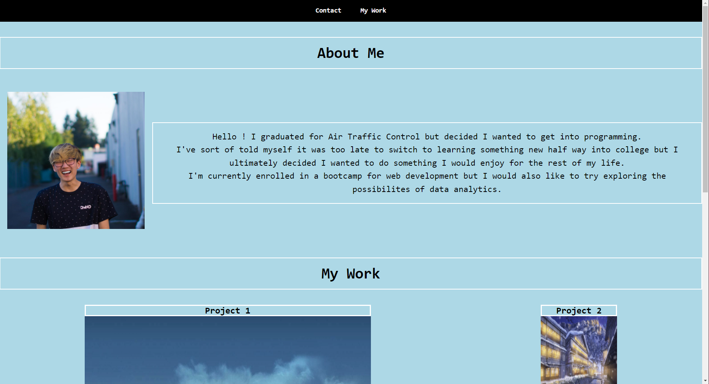
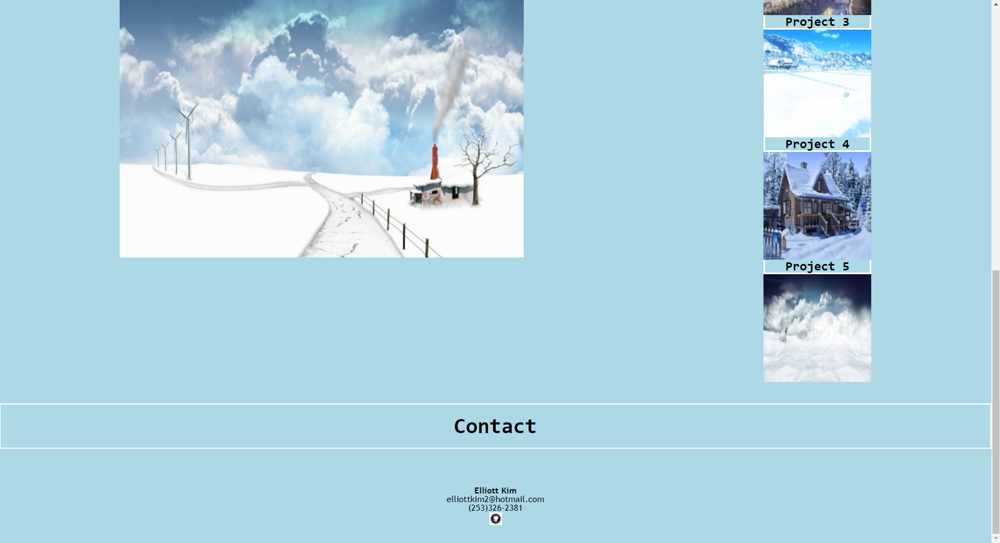

# Portfolio-EK

https://elliottpkim.github.io/Portfolio-EK/

Made a portfolio using html and CSS to help myself in the future look for a career. I build this portfolio as a template for a future portfolio once I get more expierenced. It was my first time building a website from scratch so It was a bit challenging.

SCREENSHOTS  

