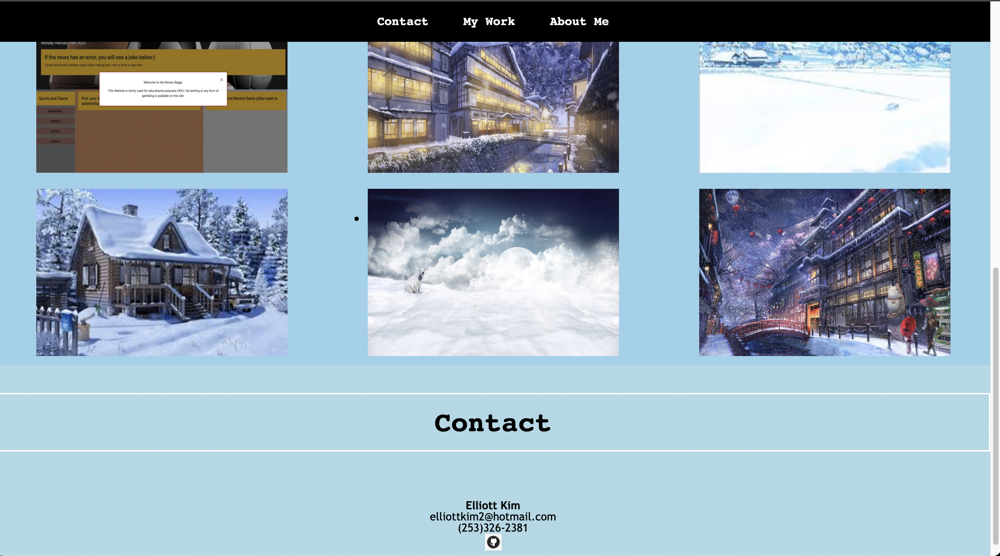

# Portfolio-EK

# Websites
https://elliottpkim.github.io/Portfolio-EK/

# Description
Made a portfolio using html and CSS to help myself in the future look for a career. I build this portfolio as a template for a future portfolio once I get more expierenced. It was my first time building a website from scratch so It was a bit challenging.

# UPDATE 
Updated Portfolio to include a project I've done in a group. Made minor adjustments like making the navbar fixed instead of sticky and changing how my images look on site. I want to add more detailed backgrounds such as actual images and sub pages within the website instead of it just being one page.

# SCREENSHOTS  

